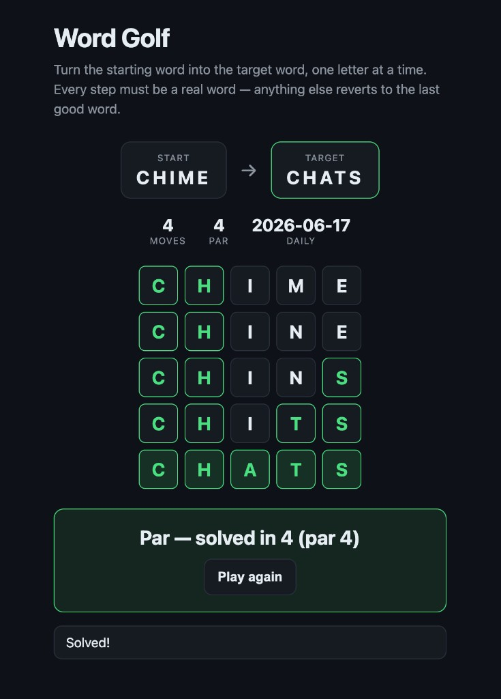

# Word Golf AutoFactory

A tiny, replayable word puzzle that doubles as a live showcase of the **[LaunchDarkly AutoFactory](https://github.com/alawrenceld/launchdarkly-auto-factory)** -- autonomous, metric-guarded releases with automatic rollback -- and as a clonable sample app for a "build your own software factory" workshop.

Turn a starting word into a target word, one letter at a time. Every step must be a real word; anything else reverts to the last good word -- the rollback metaphor at the heart of the showcase.

<p align="center">
  
</p>

> **Powered by the [LaunchDarkly AutoFactory](https://github.com/alawrenceld/launchdarkly-auto-factory).**
> The AutoFactory is the autonomous release pipeline this game showcases: a chain of AI agents flags a PR, instruments guarded-release metrics, writes tests, and runs releases that auto-roll-back on regression. Word Golf is the demo payload it operates on. Eventually the factory components will be merged into this repo so Word Golf works as a self-contained AutoFactory; until then, the upstream repo is the setup reference for the pipeline.

## Repository layout

```
  plan.md            # the full project plan (audiences, game design, phases, demo script)
  word_lists/        # source 5-letter word lists (validity set, answers, common, difficult)
  word-golf/         # the application monorepo (see word-golf/README.md)
```

> Note: the upstream `launchdarkly-auto-factory` is cloned locally during development but is not committed here (it has its own repo and history).

## Quick start

```bash
cd word-golf
npm install
npm run dev          # play locally at http://localhost:5173
npm test             # engine unit tests
npm run verify:play  # generate + auto-solve today's daily
```

Node 20+ required. See [`word-golf/README.md`](word-golf/README.md) for app details and [`plan.md`](plan.md) for the full vision and roadmap.

## Status

**Phase 0 complete:** playable Daily mode with a tested pure-TS engine (wildcard-bucket word graph, BFS par, move validation, scoring, deterministic daily generation). LaunchDarkly integration, the Mission Control showcase panel, and additional game modes are planned -- and are intended to be shipped by the AutoFactory itself (see [`word-golf/docs/FUTURE-WORK.md`](word-golf/docs/FUTURE-WORK.md)).
